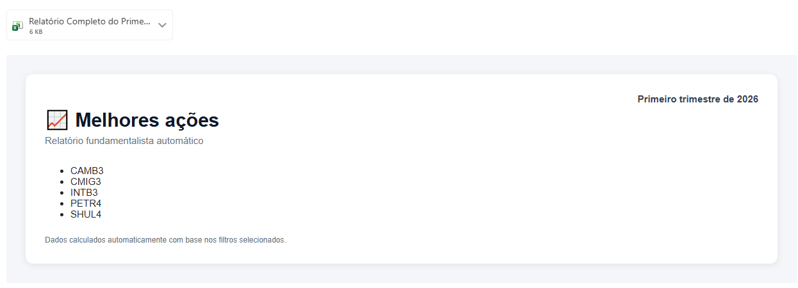
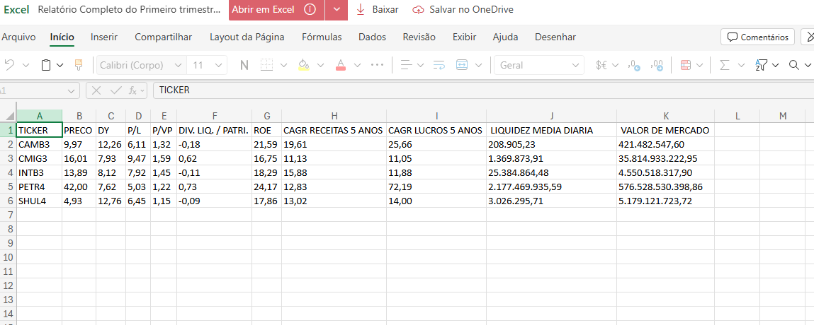

# Best_stocks

## Objetivo
O ETL tem como objetivo consultar indicadores de empresas listadas na Bolsa brasileira e fazer uma filtragem a fim de identificar as mais promissoras do trimestre em questão.

## Estrutura de pastas
```
best-stocks/
├── src/
│   ├── core/
│   │   └── extract.py
│   │   └── send_email.py
│   │   └── transform.py
│   └── utils/
│       └── logger.py
├── config.toml
├── main.py
└── README.md
```

## Funcionamento

O pipeline inicia com a consulta ao site Status Invest, fazendo uma requisição à API com o comando GET e enviando parâmetros de filtragem no seu header a fim de buscar somente as empresas de interesse. Os parâmetros dessa requisição podem ser configurados no arquivo "config.toml" e são referentes aos indicadores financeiros da análise.
Após essa primeira etapa, o dataframe recebido é tratado, sendo removidas colunas que não são importantes, linhas not a number e removendo tickers duplicados por classe de ação (ex: ITSA3, ITSA4). Um arquivo resultante é então salvo para ser anexado no e-mail posteriormente.
A etapa final é o envio de um e-mail ao RECEIVER_EMAIL configurado no .env. Nessa etapa há uma identificação do trimestre a que a análise se refere para identificação ao usuário final e o anexo gerado na etapa "transform.py" é excluído.


## Responsabilidade por módulo

|Módulo|Responsabilidade|
| :--- | :---|
|extract.py| Consulta dados
|transform.py| Trata e filtra
|send_email.py| Envia relatório
|logger.py|	Configura logs

## Como executar
```
git clone [...](https://github.com/InverseTesla/best_stocks.git)
cd best-stocks

python -m venv .venv

Linux/Mac:
source .venv/bin/activate

Windows:
.venv\Scripts\activate

pip install -r requirements.txt

python main.py
```

## Variáveis de ambiente
```
SENDER_EMAIL=seu_email@gmail.com
APP_PASSWORD=senha_de_aplicativo
RECEIVER_EMAIL=destinatario@gmail.com
```

## Config.toml 
```
[PL]
min = 3
max = 10

[ROE]
min = 15
max = 30
```

## Pipeline completo
```
Status Invest
      ↓
   Extract
      ↓
  Transform
      ↓
 Excel + HTML
      ↓
 Send Email
```

## Exemplos
### Exemplo de relatório


### Exemplo de planilha



## Tecnologias

- Python
- Pandas
- Requests
- SMTP
- TOML
- Logging

# Regras padrões para escolha de ações

### P/L
Valores maiores que 3 e menores que 10. Removendo empresas que demorem mais de 10 anos para devolver o capital e que demorem menos de 3 anos. Esse último caso pode apresentar alguma distorção. "Preço sobre lucro"

### P/PV
Valores maiores que 0,5 e menores que 2. Removendo empresas que estejam muito caras em relação ao seu patrimônio ou baratas demais. "Preço sobre valor patrimonial"

### Dividend Yield
Valores maiores que 7% e menores que 14%. "Taxa de dividendos"

### ROE
Traz a relação entre lucro líquido e patrimônio líquido. Estamos buscando retornos acima da renda fixa. Valores maiores que 15% e menores que 30%. "Retorno sobre patrimônio líquido"

### Liquidez
Acima de cem mil reais. Quanto menor a liquidez, maior é a dificuldade de vender as ações e pode ser necessário baixar o preço para vender. "Quanto pode ser resgatado em um dia"

### Crescimento médio anual de receita
Acima de 10% ao ano. "Mostra expansão do negócio"

### Crescimento médio anual de lucro
Acima de 10% ao ano. "Mostra se a empresa consegue transformar crescimento em lucro."
